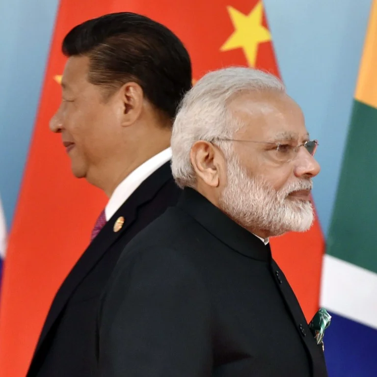

 
 
As we all know, India's border issue with China is not new. There have been several such incidents in the past and the most recent being the Doklam stand-off that lasted for 43 days in 2017. Now amid the coronavirus pandemic China is at it again, penetrating into the Indian side of the LAC.
> Army is ever ready to protect the integrity and sovereignity of the nation at all times: **COAS M M Narvane** 

Now this tactic of China raking up border issues with India or be it territorial issues with Taiwan and other regions in the South China Sea is something that it has resorted to in the past amidst rising fears of a revolt within its territory. Yes, the people of China are unhappy and angry with the way the Chinese authorities have handled the pandemic. People of China know that their President Xi stepped out of his house only after a month or so after the virus breakout to review the situation. There is huge discontent amongst the Chinese and there are pro democratic voices being heard which the Communists consider to be their utmost threat. Fall of Communism in China could as well be a final nail in the coffin for Communists throughout the world. Thus the Chinese are trying to rake up border issues and create a war like atmosphere **to hold their people at bay**. This was the same leaf that they pulled out their book in 1948 and 1962 wars with India. 

However the Chinese should not that this is not the same India that they fought against in 1962. They will be facing a well equipped and one of the best Armed Forces in the world. 
 
 

